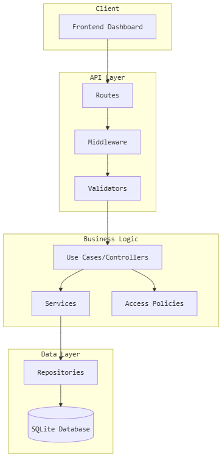

````md
# 💰 Finance Dashboard Backend

A professional-grade backend system for managing financial records with **Role-Based Access Control (RBAC)** built using **Node.js, Express, and SQLite**.

---

## 🏗 System Architecture



This diagram represents the layered architecture of the system including API, Service, and Database layers.

---

## 📖 Overview

This project is a backend system designed to manage financial records securely with authentication, authorization, and structured API design.

It follows a **modular layered architecture** for scalability, maintainability, and clean code separation.

---

## ✨ Features

- 🔐 JWT Authentication
- 👮 Role-Based Access Control (Admin / Analyst / Viewer)
- 💰 Financial Records Management
- 📊 Dashboard Analytics APIs
- 🧾 Audit Logging System
- 🧠 Clean Layered Architecture
- 🗄 SQLite Database (lightweight setup)
- 🧪 Test-ready structure

---

## 🏗 Architecture Breakdown

The system follows a layered structure:

- **Routes Layer** → API endpoints
- **Middleware Layer** → Authentication, RBAC, validation
- **Controller Layer** → Request handling logic
- **Service Layer** → Business logic
- **Repository Layer** → Database operations

---

## 📁 Project Structure

```bash
finance-dashboard-backend/
│
├── src/
│   ├── config/          # Database & environment config
│   ├── middleware/      # Auth, RBAC, validation
│   ├── modules/
│   │   ├── auth/        # Login & register
│   │   ├── users/       # User management
│   │   ├── records/     # Financial transactions
│   │   └── dashboard/   # Analytics
│   ├── utils/           # Helper functions
│   ├── app.js           # Express app setup
│   └── server.js        # Entry point
│
├── tests/               # Unit & integration tests
├── assets/              # Images (diagram.png)
└── README.md
````

---

## 🗄 Database Schema

### 👤 Users

* id
* email
* password_hash
* role (admin / analyst / viewer)

### 💰 Financial Records

* id
* user_id
* amount
* type (income / expense)
* category
* date

### 🧾 Audit Logs

* id
* user_id
* action
* timestamp

---

## 👮 Role-Based Access Control (RBAC)

| Role    | Permissions                             |
| ------- | --------------------------------------- |
| Admin   | Full access (users, records, analytics) |
| Analyst | Read + analytics access                 |
| Viewer  | Read-only access                        |

---

## 📡 API Endpoints

### 🔐 Authentication

```bash
POST /api/auth/register
POST /api/auth/login
GET  /api/auth/me
```

---

### 💰 Records

```bash
GET    /api/records
POST   /api/records
PUT    /api/records/:id
DELETE /api/records/:id
```

---

### 📊 Dashboard

```bash
GET /api/dashboard/summary
GET /api/dashboard/analytics
```

---

## ⚙️ Setup & Installation

### 1️⃣ Clone Repository

```bash
git clone <your-repo-url>
cd finance-dashboard-backend
```

---

### 2️⃣ Install Dependencies

```bash
npm install
```

---

### 3️⃣ Environment Setup

Create `.env` file:

```env
PORT=3000
JWT_SECRET=your-secret-key
JWT_REFRESH_SECRET=your-refresh-secret
DB_PATH=./data/finance.db
```

---

### 4️⃣ Run Project

```bash
# Development
npm run dev

# Production
npm start
```

---

## 🔐 Default Admin Credentials

```bash
Email: admin@finance.local
Password: admin123
```

---

## ⚖️ Design Decisions

* Layered architecture for clean separation
* JWT for stateless authentication
* SQLite for lightweight setup
* RBAC for secure access control
* Service-repository pattern for maintainability

---

## 🚀 Future Improvements

* PostgreSQL migration
* Swagger API documentation
* Redis caching
* Advanced analytics dashboard
* React frontend integration

---

## ⭐ Support

If you like this project, give it a ⭐ on GitHub!

```
